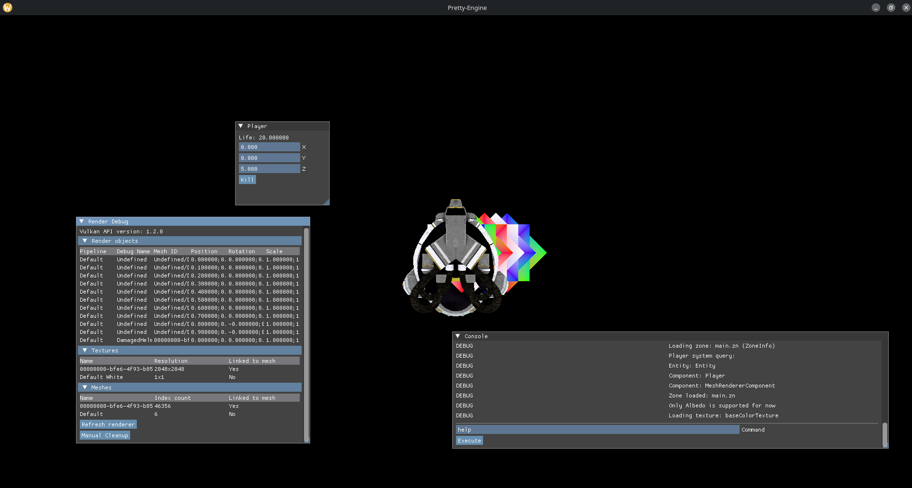

## Goal

The goal is to make a game engine.
To learn about it, and improve my skills.

At the same time, I love working on projects that don't rely on third-party libraries.

## Requirements

- Familiarity with C++ and modern C++ features
- Understanding of game development concepts and principles
- Experience with version control systems (e.g., Git)
- Knowledge of graphics APIs (e.g., OpenGL, Vulkan)
- Familiarity with game engine architecture and design patterns
- Experience with game engine development tools and frameworks (e.g., Unreal Engine, Unity)
- Data management and optimizations
- Multithreading and synchronization

## Current state of development

The project is currently paused, I am working on a game using Unity as I need to train using Unity.
And to add projects to my portfolio, sadly requiring to let the engine development on hold.

But it is in progress on improving the multithreading support, and improving the docs and unit tests.
A lot of the background work is already done, such as:
- Single threaded ECS
- Asset load/unload
- Rendering of a 3D object
- Processes
- ImGUI Integrations

## Technologies

| Technology                                                 | Usage                                                                                 |
|------------------------------------------------------------|---------------------------------------------------------------------------------------|
| [Vulkan](https://www.vulkan.org/)                          | Main graphic API                                                                      |
| [OpenGL](https://www.opengl.org/)                          | Fallback graphic API                                                                  |
| [SLang](https://shader-slang.org/)                         | Shader language                                                                       |
| [LZ4](https://github.com/lz4/lz4)                          | Compression library                                                                   |
| [GLM](https://github.com/g-truc/glm)                       | Algebra library                                                                       |
| [GLFW](https://www.glfw.org/)                              | Cross-platform window management                                                      |
| [PugiXML](https://pugixml.org/)                            | XML Parser                                                                            |
| [VMA](https://gpuopen.com/vulkan-memory-allocator/)        | Helper library for Vulkan                                                             |
| [Corrosion](https://gpuopen.com/vulkan-memory-allocator/)  | Library to allow using Rust code (not used yet, but will be used later for scripting) |
| [Tracy](https://github.com/wolfpld/tracy)                  | Profiler complete, open-source and easy to use                                        |
| [Stringzilla](https://github.com/ashvardanian/Stringzilla) | Future-proof choice, to avoid strings becoming a bottleneck                           |
| [Doctest](https://github.com/doctest/doctest)              | Unit testing framework                                                                |
| [RmlUI](https://github.com/mikke89/RmlUi)                | In game user interface                                                                |

## Inspirations

### Unity

For the versatility and the ease of use.

Also help to understand how to manage assets and resources properly.

### Unreal Engine

For editing, and scripting.

### Bevy

For the ECS architecture and the flexibility.

## General Architecture

The engine is contained in a class named Engine.

All the custom logic is loading using a reflection system.

### Engine Initialization

Surely, all engine parts are initialized in async, launched by the Engine::Load() function.
It is blocking the current thread until all parts are loaded.

Allowing a fast initialization of the engine.
And you can add a loading screen if you want, while the Load() function is running.

Then you only need to tell the engine Engine::Run() to start the game loop.

It will use many threads, but if the CPU cannot handle it, it will use the main thread.
But from the User side code, the thread limit can be omitted as the engine will handle correctly the overload.

PS: If you use the task launching system, you can't have too many threads, as it will reuse the workers.
It uses the main thread only when you have a dedicated worker thread.

### Rendering

It uses a concept of Render components, where each component can be Activated or Deactivated, receive update events each frame, and can be Refreshed if necessary (example: resolution changed).
This allows you to easily separate rendering tasks and can detect if a Component takes time to run.

They are also receiving an event when an error, warning, or info is sent in the renderer, from the exterior or from the Renderer itself.
If they send an error, they may be refreshed, to avoid crashing the application.

Components can deactivate themselves if they are no more useful.
Each component have access to other components, to allow working together, and can have SharedRenderComponentData, to share data between components.

I am currently working on finding out how to correctly implement graphics API fallback, without an extensive number of code lines.

### Gameplay logic

The logic is contained in a class named Space.
The space have a specific interface towards the engine.
Allowing to safely control the engine. Meaning you don't need great knowledge of the engine to use it.

In the other side, you have the Process, that are in the engine.
And are kind of unsafe, but receive a lot of events, and can do whatever you want with the engine.
Can be useful to add complex features.

### Space and Zone system

#### Space

It's the logic container of the engine, all it does is about allowing the player to run logic.
Handling the ECS, and events.
The engine use it as an interface over the user space.
It is also a lot connected to the Processes concept.
A process is an object that has access to everything in the engine.
And so can be used for a wide amount of purpose.
A special example of the usage of a Process object, is to load the first level in your game,
and initialize the required systems.

#### Zone

A zone is a container of an ECS group, that contains entities, systems and components.
Each zone can be loaded, or unloaded at any moment, they are pieces of the game puzzle.

In the future they will be loaded and unloaded automatically.
Each zone are identified, and so objects dont override another zone.
A zone can be constant, and so then once loaded, can't be unloaded.

And so, a pack of zone compose a level, but a level can be a single zone.
They are not scenes, as they are part of the main scene that is the Space.s

## GitLab

I moved from GitHub to GitLab.
Because I wanted to not rely only on GitHub.
And I could self-host my own GitLab instance.

## Conclusion

The engine still requires a lot of work, but it is on the good way.
I don't have a precise date on when it will be ready, but I am working on it.
